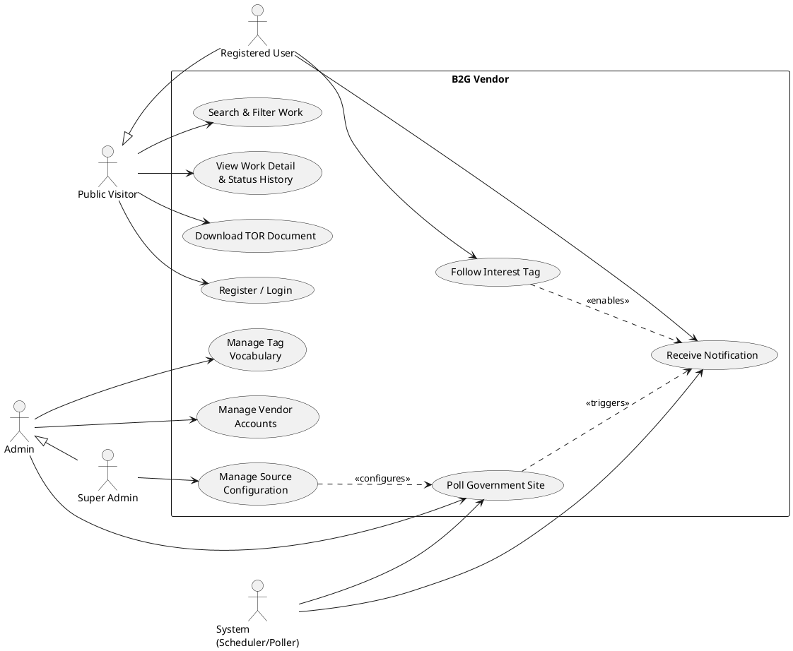

# Software Requirements Specification

for

**B2G Vendor**

Version 0.1

Prepared by Techaphatr Indhavivadhana

OTK

22/08/2026

---

## Table of Contents

1. [Introduction](#1-introduction)
   1.1 [Purpose](#11-purpose)
   1.2 [Document Conventions](#12-document-conventions)
   1.3 [Intended Audience and Reading Suggestions](#13-intended-audience-and-reading-suggestions)
   1.4 [Product Scope](#14-product-scope)
   1.5 [Stakeholders](#15-stakeholders)
   1.6 [References](#16-references)
2. [Overall Description](#2-overall-description)
   2.1 [Product Perspective](#21-product-perspective)
   2.2 [Product Functions](#22-product-functions)
   2.3 [User Classes and Characteristics](#23-user-classes-and-characteristics)
   2.4 [Design and Implementation Constraints](#24-design-and-implementation-constraints)
   2.5 [Assumptions and Dependencies](#25-assumptions-and-dependencies)
3. [Specific Requirements (User Stories)](#3-specific-requirements-user-stories)
   3.1 [Account & Access Management](#31-account--access-management)
   3.2 [Government Data Ingestion & Source Management](#32-government-data-ingestion--source-management)
   3.3 [Interest Tags & Notifications](#33-interest-tags--notifications)
   3.4 [Search, Browse & Status Display](#34-search-browse--status-display)
   3.5 [TOR Document Access](#35-tor-document-access)
4. [System Features](#4-system-features)
   4.1 [Account & Access Management](#41-account--access-management)
   4.2 [Government Data Ingestion & Source Management](#42-government-data-ingestion--source-management)
   4.3 [Interest Tags & Notifications](#43-interest-tags--notifications)
   4.4 [Search, Browse & Status Display](#44-search-browse--status-display)
   4.5 [TOR Document Access](#45-tor-document-access)
5. [Non-Functional Requirements](#5-non-functional-requirements)
   5.1 [Performance Requirements](#51-performance-requirements)
   5.2 [Safety Requirements](#52-safety-requirements)
   5.3 [Security Requirements](#53-security-requirements)
   5.4 [Software Quality Attributes](#54-software-quality-attributes)
   5.5 [Business Rules](#55-business-rules)
6. [Use Case Model](#6-use-case-model)
   6.1 [Use case diagram](#61-use-case-diagram)
   6.2 [Use case descriptions](#62-use-case-descriptions)
7. [Open Issues and Assumptions](#7-open-issues-and-assumptions)
   7.1 [Unclear Requirements](#71-unclear-requirements)
   7.2 [Justified Assumptions](#72-justified-assumptions)
8. [Appendices](#8-appendices)
   8.1 [Glossary](#81-glossary)

---

## 1. Introduction

### 1.1 Purpose

The purpose of this document is to specify the software requirements for **B2G Vendor**. This SRS describes the functional and non-functional requirements for the public-facing web application and its administrative console that together ingest, index, and disclose government procurement and Terms of Reference (**TOR**) data from multiple Thai government agencies.

The scope of this document covers the full lifecycle of the platform, including:

- Unified account registration and login (individual and business).
- Admin-controlled polling of government open-data sources.
- Subscription to interest tags and notification of matching new work.
- Cross-site search with live, source-derived status display.
- TOR document access and download.

**Out of Scope:** This SRS explicitly excludes any bidding, deal execution, or announcement-publishing functionality — the platform is strictly a read-only disclosure and notification layer. It also excludes the internal operation of any government e-GP system and the internal training or operation of the third-party AI service used for auto-tagging.

### 1.2 Document Conventions

The following conventions are used throughout this document:

- **Boldface** is used to emphasize specific user interface elements (e.g., buttons, page titles) and actor names.

- `Courier New` font is used for system states, error messages, and technical field/status values (e.g., `BIDDING`, `Poll Timeout`).

- Priorities for requirements are assumed to be **High** unless explicitly marked as **Optional** or **Low Priority**.

- The term "**User**" refers to a Registered User unless "**Visitor**" is specified.

### 1.3 Intended Audience and Reading Suggestions

This document is intended for the following stakeholders:

- **Product Owner:** Should focus on Section 2 (Overall Description) and the User Stories in Section 3 to ensure the disclosure and notification experience aligns with vendor needs.

- **Developers:** Should review Section 3 (Specific Requirements) in detail, paying close attention to the Functional Requirements and Non-Functional Requirements (such as per-site poll rate limits, Argon2/bcrypt hashing, and the Admin vs. Super Admin role split).

- **Testers:** Should use Section 3 as the primary basis for creating Test Cases and acceptance criteria, specifically noting the boundary values (e.g., the 7-site launch scope, poll interval presets, and session timeout).

It is recommended that all readers start with Section 1 and Section 2 for a high-level understanding before diving into the technical specifications in Section 3.

### 1.4 Product Scope

B2G Vendor is a standalone web platform designed to centralize government procurement disclosure. It acts as a unifying interface between vendors, businesses, and the public on one side, and the scattered procurement/TOR datasets published by multiple government agencies on the other.

The primary objective of the software is to remove the need to separately monitor each agency's own procurement page, by polling two official sources on an admin-controlled schedule and surfacing the results through unified search and notifications: the **e-GP RSS feed** (`process3.gprocurement.go.th`) for live new/updated TOR announcements, and the **`data.go.th`** open-data catalog for historical contract-level enrichment once a project is awarded. Key benefits include:

- **Accessibility:** One search across every connected government site instead of many.
- **Personalization:** Users follow interest tags (site, agency, method, category, keyword) and are notified only about relevant new work.
- **Transparency:** Status is always derived from ingested source data — never manually edited — so search results, work detail, and notifications never disagree with one another.

The system is constrained to **7 government sites at launch** (BMA, Department of Highways, PEA, EGAT, Office of the Permanent Secretary of the Ministry of Public Health, depa, and DGA), extensible only by a Super Admin, and it never scrapes HTML — ingestion is strictly via polling the e-GP RSS feed and `data.go.th`.

### 1.5 Stakeholders

- **Product Owner:** The Visionary. Defines which government sites and features ship first, and ensures the search and notification experience matches real vendor workflows.

- **Developers:** The Builders. Write the per-site ingestion adapters, the tag-matching and notification engine, and the search/status layer, and manage the database.

- **Testers:** The Quality Gatekeeper. Verify poll reliability across sites, tag-notification accuracy, and that role-based access (Admin vs. Super Admin) is enforced everywhere it matters.

- **Registered Users (Vendors, Businesses/SMEs, Public researchers):** The End-Consumers. Follow interest tags, search and filter work, and download TOR documents.

- **Government Agencies:** The Data Publishers. An indirect stakeholder — the system depends on the continued availability and schema stability of their published datasets, but does not interact with or modify their systems.

### 1.6 References

- IEEE Std 830-1998, *IEEE Recommended Practice for Software Requirements Specifications.*

- `data.go.th` (Open Government Data of Thailand), *CKAN Action API Documentation.* (For historical/enrichment ingestion.)

- e-GP RSS Feed, `process3.gprocurement.go.th/EPROCRssFeedWeb/egpannouncerss.xml`. (For live TOR announcement ingestion — the primary data source.)

- Thailand Personal Data Protection Act (PDPA) B.E. 2562 (2019). (For user and notification data handling.)

- Web Content Accessibility Guidelines (WCAG) 2.1, Level AA. (For accessibility requirements.)

---

## 2. Overall Description

### 2.1 Product Perspective

B2G Vendor is a web application that functions as a unifying interface between the public/vendors and the scattered procurement-disclosure datasets published by multiple government agencies. It is not part of any government e-GP system and does not modify or publish to those systems — it is strictly read-only.

The system is designed with a **Modular Architecture**, decoupling the **"Ingestion/Polling Engine"** (one adapter per connected government site, per source) from the **"Web & Search Application."** This ensures a schema change or outage at any one government site — or at either source — is isolated to its own adapter, and that the search and notification layers keep operating on already-ingested data even if the newest poll for one site is delayed or failing.

System Interfaces:

- **User Interface:** Accessible via modern web browsers (Chrome, Edge, Safari, Firefox).
- **Live Data Source Interface:** Polls the e-GP RSS feed (`process3.gprocurement.go.th`) per government site and per announcement type — the primary source of new/updated TOR data.
- **Historical Data Source Interface:** Polls the `data.go.th` open-data catalog (CKAN Action API) to enrich already-ingested work with post-award contract/budget/winner facts.
- **Notification Interface:** In-app notification center plus authenticated transactional email (SPF/DKIM/DMARC).
- **Search Interface:** A dedicated search index with Thai tokenization and typo tolerance.

### 2.2 Product Functions

B2G Vendor provides four major functional groups:

- **Account & Access Management**
  - Unified registration/login for individual and business accounts.
  - Role-based access: Visitor, Registered User, Admin, Super Admin.

- **Government Data Ingestion**
  - Manual ("Poll Now") and scheduled polling, per government site.
  - Per-site run history (fetched / new / updated / failed).
  - Source configuration (which sites are polled) restricted to Super Admin.

- **Interest Tags & Notifications**
  - Follow tags across government site, agency, method, category, and keyword.
  - Automatic, AI-assisted tagging of newly ingested work.
  - In-app and email notification when a followed tag matches new work.

- **Search & Status Display**
  - Full-text and faceted search across every connected site.
  - Status badge sourced only from ingested data — never manually edited.
  - TOR document download.

### 2.3 User Classes and Characteristics

The system identifies four primary user classes, plus one non-human actor. The focus of this SRS is strictly on the **Registered User** and the **Admin/Super Admin** roles, as they are the primary actors for all core functions.

- **Public Visitor (Secondary)**
  - *Characteristics:* An unauthenticated browser of public disclosure data. May range from a first-time researcher to a returning vendor who has not yet registered.
  - *Privileges:* Full search, work detail, and TOR download.
  - *Restrictions:* Cannot follow interest tags or receive notifications until registering.

- **Registered User (Primary)**
  - *Characteristics:* An individual or business account holder. May vary from an occasional bidder to a vendor monitoring dozens of tags daily.
  - *Privileges:* Everything a Visitor can do, plus following unlimited interest tags, receiving notifications, and managing their own profile.
  - *Constraints:* Subject to standard session expiry and PDPA-governed handling of contact and preference data.

- **Admin**
  - *Characteristics:* Portal operations staff responsible for day-to-day data quality.
  - *Privileges:* Trigger and schedule polling, review run history, manage the tag vocabulary, manage vendor accounts, review the audit log.
  - *Restrictions:* Cannot add, remove, or repoint which government sites are polled.

- **Super Admin (Primary among staff)**
  - *Characteristics:* Senior or trusted operations staff, a tier above Admin.
  - *Privileges:* Everything an Admin can do, plus **source configuration** — adding a new government site, enabling/disabling one, and setting its poll scope and request-rate limit.
  - *Restrictions:* Still bound by a fixed internal concurrency-safety limit that is not exposed as a setting to anyone, including Super Admin.

- **System (Non-human)**
  - *Characteristics:* The automated poller, scheduler, change-detector, notification engine, and search indexer.
  - *Behavior:* Acts only on Admin/Super Admin-configured schedules and scope; never publishes or edits source data.

### 2.4 Design and Implementation Constraints

The design and development of B2G Vendor must adhere to the following strict constraints:

- **Regulatory & Security:**
  - Data Encryption: All transmission must use HTTPS (TLS 1.2+).
  - Password Storage: Local account passwords must be hashed using Argon2 or bcrypt.
  - Data Source Credentials: Any dataset/API access details are stored in server-side configuration, never exposed to the client.

- **Data Source:**
  - No Scraping: Ingestion is strictly via the e-GP RSS feed (live) and the `data.go.th` open-data catalog (historical enrichment) for every connected government site — never by parsing an HTML page.
  - Correct Encoding: The e-GP RSS feed is Windows-874 (Thai codepage) encoded, not UTF-8, despite looking like standard XML; it must be decoded explicitly as Windows-874.
  - Adapter Isolation: Each government site's response mapping lives in its own adapter, per source, since dataset schemas differ by organization and the two sources are structurally different (XML/RSS vs. JSON/CKAN).

- **Hardware & Performance:**
  - Search Latency: Faceted search results must return within 1.5 seconds at p95 for typical queries.
  - Poll Etiquette: Each site's poll respects that site's own configured request-rate limit.
  - Page Load: Core public pages interactive within 2.5 seconds on mid-range mobile / 4G.

- **Business Rules:**
  - Launch Scope: 7 government sites at launch, extensible later.
  - Source Config Gate: Adding/enabling/disabling a government site is restricted to Super Admin.
  - Status Integrity: Status values are never manually editable; they come only from ingested source data.

### 2.5 Assumptions and Dependencies

The requirements in this SRS rely on the following assumptions:

1. **Live Data Source Availability:** The system depends on the continued availability of the e-GP RSS feed, since it is the primary and only source that can discover a new or updated TOR. An outage there stops "new work" detection entirely for the affected site until the feed recovers.

2. **Historical Data Source Availability:** The system depends on the continued availability and schema stability of `data.go.th`'s per-agency contract datasets for enrichment only. An outage or breaking schema change there degrades budget/winner enrichment for that site, but does not stop new TOR from being discovered via the RSS feed.

3. **AI Service Availability:** Automatic tagging is a best-effort dependency on a third-party AI service (planned: Vertex AI). Its unavailability degrades tagging quality but does not block ingestion.

4. **Browser Capability:** Users access the application via modern web browsers that support standard TLS and responsive layouts.

5. **Site Coverage:** Each of the 7 launch government sites is assumed to have a resolvable e-GP department code (`deptId`) for the live feed, and, where available, a resolvable `data.go.th` organization for enrichment — confirmed for all 7 during requirements analysis.

---

## 3. Specific Requirements (User Stories)

### 3.1 Account & Access Management

**US-1.1:** As a Visitor, I want to register once with either an individual or business profile, so that I don't need to pick between separate account types.

**US-1.2:** As a Visitor, I want to log in with a single unified form, so that I don't need to remember which account type I used.

**US-1.3:** As a User, I want access to following tags and notifications restricted until I log in, so that my interests are saved securely to my personal profile.

**US-1.4:** As a User, I want to reset my password by email, so that I can regain access without contacting support.

**US-1.5:** As an Admin, I want to search, add, and suspend or delete vendor accounts, so that I can manage the account base on an ongoing basis.

### 3.2 Government Data Ingestion & Source Management

**US-2.1:** As an Admin, I want to trigger a manual poll for one government site or all enabled sites, so that I can refresh data immediately when needed.

**US-2.2:** As an Admin, I want to set a recurring poll interval, so that data stays current without manual work.

**US-2.3:** As an Admin, I want to see each poll run's results broken down by government site, so that I can trust the data and catch failures at any one source.

**US-2.4:** As a Super Admin, I want to add a new government site to the poll list, so that coverage can grow without a code change or redeploy.

**US-2.5:** As a Super Admin, I want to enable or disable a specific government site, so that I can pause a source that is misbehaving without affecting the others.

**US-2.6:** As an Admin, I want a failed poll to retry and alert me, so that an outage at one government site doesn't silently break the rest of the portal.

### 3.3 Interest Tags & Notifications

**US-3.1:** As a User, I want to follow multiple interest tags across government site, agency, method, category, and keyword, so that I hear about all the kinds of work I care about.

**US-3.2:** As a User, I want to be notified when newly ingested work carries a tag I follow, so that I don't have to check manually.

**US-3.3:** As a User, I want to choose notification channel and frequency (in-app, email; instant or daily digest), so that I control volume.

**US-3.4:** As a User, I want to add or remove followed tags at any time, so that I can tune what I'm subscribed to as my interests change.

**US-3.5:** As an Admin, I want to create and retire tags, so that the vocabulary stays clean without duplicate or near-duplicate entries.

### 3.4 Search, Browse & Status Display

**US-4.1:** As a Visitor, I want fast, typo-tolerant search across titles, metadata, and TOR content, so that I can find work even by terms inside the TOR.

**US-4.2:** As a Visitor, I want to filter results by status, government site, agency, method, budget, and date, so that I can narrow results precisely.

**US-4.3:** As a Visitor, I want to see each work's status directly in the results list, so that I can tell open vs. closed/cancelled without opening each one.

**US-4.4:** As a Visitor, I want to browse by government site and then by department, so that I can follow a specific organization's activity.

**US-4.5:** As a Visitor, I want clear loading, empty, and error states, so that the site never looks blank or broken.

### 3.5 TOR Document Access

**US-5.1:** As a Visitor, I want to open a work's detail page to see its full metadata and status history, so that I can evaluate whether it's relevant to me.

**US-5.2:** As a Visitor, I want to download the TOR and any attachments directly, so that I have the official documents.

---

## 4. System Features

This section organizes the specific functional requirements into logical features. Each feature includes a description, the specific system behaviors (`The system shall...`), and a traceability mapping to the corresponding User Story (US).

### 4.1 Account & Access Management

**Description:** This feature manages user identity, ensuring one unified login for both individual and business accounts. It handles session persistence, password hashing, and account administration.

- **Functional Requirements:**
  - **FR-1.1:** The system shall provide a single `Account` entity where individual/business is an attribute, not a separate login flow.
  - **FR-1.2:** The system shall capture business fields (tax ID, company name) in an optional business profile on the same account.
  - **FR-1.3:** The system shall authenticate all users through one unified login form regardless of account type.
  - **FR-1.4:** The system shall restrict tag-following and notification settings to authenticated users only.
  - **FR-1.5:** The system shall allow Admins to search, add, suspend/reactivate, and delete vendor accounts directly from an account list.
  - **FR-1.6:** The system shall log every account status change (suspend, reactivate, delete) with actor and timestamp.

- **Traceability:**
  - US-1.1 (Register) → FR-1.1, FR-1.2
  - US-1.2 (Unified Login) → FR-1.3
  - US-1.3 (Restrict Access) → FR-1.4
  - US-1.5 (Manage Accounts) → FR-1.5, FR-1.6

### 4.2 Government Data Ingestion & Source Management

**Description:** The core feature that pulls procurement and TOR data from every connected government site via **two sources** — the e-GP RSS feed (live, primary) and `data.go.th` (historical, enrichment-only) — normalizes it into one schema, and makes it available to search and notifications. Source configuration is gated behind Super Admin.

- **Functional Requirements:**
  - **FR-2.1:** The system shall allow an Admin to immediately run an ingestion job against one site or all enabled sites and report results.
  - **FR-2.2:** The system shall allow an Admin to configure a recurring poll interval per site, which the scheduler runs automatically and can pause/resume.
  - **FR-2.3:** The system shall, for each configured site's e-GP department code (`deptId`), poll the e-GP RSS feed across its enabled announcement types (draft TOR, invitation, cancellation, amendment, winner, reference price, procurement plan) and extract each item's title, project identifier, announcement-type label, publish date, and link. **This is the primary and only source capable of discovering a new or updated TOR.**
  - **FR-2.3a:** The system shall classify each RSS item's link as either a direct document (e.g. PDF) or an HTML detail-page reference before storage; a direct document shall be downloaded and stored, while an HTML reference shall be recorded as a URL only, without being fetched or parsed.
  - **FR-2.4:** The system shall upsert ingested records by a stable key (the project identifier) scoped per site, so re-polling updates rather than duplicates, and so records from either source correlate to the same work.
  - **FR-2.5:** The system shall flag brand-new works and changed fields (especially status) and emit events consumed by the notification and search features.
  - **FR-2.6:** The system shall record, per government site and per source, a run's start/end time, counts (fetched / new / updated / skipped / failed), and errors, viewable and filterable in the admin panel.
  - **FR-2.7:** The system shall retry a failed poll with backoff and alert the Admin; a failure at one government site or one source shall not corrupt already-ingested data or block polling of the others.
  - **FR-2.8:** The system shall restrict adding, removing, enabling, disabling, or repointing a government site to Super Admin only; Admins may view but not edit the site list.
  - **FR-2.9:** The system shall prevent a manual poll and a scheduled poll for the same site and source from running destructively at the same time.
  - **FR-2.10:** The system shall periodically fetch each configured site's `data.go.th` contract-level dataset, where one exists, and attach budget, contract number/dates, and winner information to the matching already-ingested work by its project identifier. This source shall never create a new work on its own.

- **Traceability:**
  - US-2.1 (Manual Poll) → FR-2.1
  - US-2.2 (Scheduled Poll) → FR-2.2
  - US-2.3 (Run History) → FR-2.6
  - US-2.4 (Add Site) → FR-2.8
  - US-2.5 (Enable/Disable Site) → FR-2.8
  - US-2.6 (Retry & Alert) → FR-2.7, FR-2.9

### 4.3 Interest Tags & Notifications

**Description:** Manages the controlled tag vocabulary, AI-assisted automatic tagging of ingested work, and the matching/notification pipeline that alerts users when a followed tag appears on new work.

- **Functional Requirements:**
  - **FR-3.1:** The system shall let a user follow tags from a controlled taxonomy grouped by facet (site, agency, method, category, keyword), addable/removable at any time.
  - **FR-3.2:** The system shall automatically assign each ingested work 1..N tags, derived from its government site and agency/method (structured fields) plus AI-based classification of its Thai-language title and TOR text for category/keyword tags, optionally admin-curated afterward.
  - **FR-3.3:** The system shall, on every "new work" event, compute the intersection of the work's tags and each user's followed tags and queue a notification for every matched user.
  - **FR-3.4:** The system shall allow an Admin to create and retire tags and reassign a work's tags; duplicate/near-duplicate tags are prevented at creation and resolved by retiring the redundant one, not by merging.
  - **FR-3.5:** The system shall deliver notifications via an in-app notification center (required) and email (optional), with instant or daily-digest frequency.
  - **FR-3.6:** The system shall send at most one notification per work per user, even if multiple followed tags match or the work is re-polled.
  - **FR-3.7:** The system shall allow a user to pause, edit, or delete a followed tag, and support email unsubscribe without requiring login.

- **Traceability:**
  - US-3.1 (Follow Tags) → FR-3.1
  - US-3.2 (Get Notified) → FR-3.2, FR-3.3
  - US-3.3 (Channel/Frequency) → FR-3.5
  - US-3.4 (Edit Tags) → FR-3.7
  - US-3.5 (Admin Tag Management) → FR-3.4

### 4.4 Search, Browse & Status Display

**Description:** Provides fast, typo-tolerant, faceted search across every connected government site, and shows each work's status consistently in results and detail — always sourced from ingestion, never edited by hand.

- **Functional Requirements:**
  - **FR-4.1:** The system shall provide full-text search across title, agency, metadata, and extracted TOR document text.
  - **FR-4.2:** The system shall provide faceted filters for status, government site, agency, method, budget range, and date range, reusing the same tag taxonomy as the Interest Tags feature.
  - **FR-4.3:** The system shall display a color-coded, text-labeled status badge on every result row and on the work detail page, reflecting the latest status derived from the e-GP RSS announcement type, with no manual override path. `data.go.th` enrichment records carry no status field and never affect this badge.
  - **FR-4.4:** The system shall provide a government site directory, drillable into department/agency, linking to each site's ingested works.
  - **FR-4.5:** The system shall show a consistent loading skeleton, empty state, and retryable error state whenever results cannot be shown immediately.
  - **FR-4.6:** The system shall use Thai-aware tokenization and typo tolerance so that search works despite Thai having no word spacing.

- **Traceability:**
  - US-4.1 (Search) → FR-4.1, FR-4.6
  - US-4.2 (Filters) → FR-4.2
  - US-4.3 (Status in Results) → FR-4.3
  - US-4.4 (Browse by Site) → FR-4.4
  - US-4.5 (Loading/Empty/Error) → FR-4.5

### 4.5 TOR Document Access

**Description:** Provides access to a work's full detail, status history, and the ability to download its official TOR documents and attachments.

- **Functional Requirements:**
  - **FR-5.1:** The system shall provide a detail page showing title, agency, method, budget, dates, current status, and linked TOR/attachments, all sourced from ingested data.
  - **FR-5.2:** The system shall provide working, HTTPS download links to every ingested TOR file and attachment.
  - **FR-5.3:** The system shall deduplicate downloaded files by hash so an unchanged document is not re-downloaded on every poll.
  - **FR-5.4:** The system shall display a chronological status-change history on the detail page, matching the same status source of truth used in search.

- **Traceability:**
  - US-5.1 (View Detail) → FR-5.1, FR-5.4
  - US-5.2 (Download TOR) → FR-5.2, FR-5.3

---

## 5. Non-Functional Requirements

### 5.1 Performance Requirements

This section defines the specific timing and throughput constraints the system must meet to ensure a smooth user experience.

- **Page Load Speed:** The web application shall render core public pages interactive within 2.5 seconds on mid-range mobile / 4G.

- **Search Latency:** Faceted search results (with status and facets) shall return within 1.5 seconds at p95 for typical queries.

- **Notification Timeliness:** Instant notifications shall be dispatched within approximately 5 minutes of the poll that discovered the matching work.

- **Ingestion Throughput:** The system shall support incremental polling (only new/changed items since the last run where possible) to keep each run fast and light.

- **Poll Timeout:** If a poll for a given site exceeds a configured duration, the system shall time out that run, log it as failed, and alert the Admin (`Poll Timeout`) rather than hang indefinitely.

### 5.2 Safety Requirements

This section outlines safeguards to prevent data loss or system failure scenarios that could negatively impact users.

- **Ingestion Transactionality:** Ingestion shall be transactional per item; a crashed run shall resume cleanly without half-written records.

- **Failure Isolation:** A poll failure isolated to one government site shall not corrupt already-ingested data or block polling of the others.

- **Retry on Transient Failure:** If a poll fails due to a transient error, the system shall retry with backoff before reporting a final failure to the Admin.

- **Notification Deduplication:** Re-processing an ingestion event shall never result in a duplicate notification to the same user for the same work.

### 5.3 Security Requirements

This section defines the measures required to protect user data, identity, and system integrity.

- **Data Encryption in Transit:** All data transmitted between client and server shall be encrypted using HTTPS (TLS 1.2 or higher).

- **Password Storage:** For local accounts, the system shall never store passwords in plain text; all passwords must be hashed using Argon2 or bcrypt before storage.

- **Role-Based Access Control:** The admin panel shall enforce strong authentication and role checks, with an explicit Admin vs. **Super Admin** split for higher-risk settings such as source configuration.

- **Source Config Protection:** Adding, removing, enabling, or disabling a government site shall be accessible to Super Admin only; the restriction shall be enforced server-side, not only hidden in the UI.

- **Injection & Rate Limiting:** The system shall apply OWASP Top 10 protections (especially injection on search) and rate limiting on authentication, search, and admin poll endpoints.

- **Privacy:** Contact information, notification preferences, and followed tags shall be stored and processed in a PDPA-compliant manner, with per-channel opt-in.

### 5.4 Software Quality Attributes

This section details the quality characteristics important for the long-term maintenance and usability of the product.

- **Availability:** The system shall target 99.5% uptime; ingestion failures shall not take the read-only public site down.

- **Scalability:** Tag-intersection matching and notification fan-out shall run asynchronously on a queue, and the web tier shall be horizontally scalable.

- **Maintainability (Modular Architecture):** Each government site's response mapping shall be isolated in its own adapter, so a schema change at one site can be fixed without touching the others.

- **Accessibility:** The application shall meet WCAG 2.1 Level AA, with status never conveyed by color alone, and full Thai localization.

- **Portability (Browser Support):** The application shall function correctly on all modern browsers, specifically Chrome, Firefox, Safari, and Edge.

- **Discoverability (SEO):** Public search and detail pages shall be server-rendered or pre-rendered so content and status are indexable.

### 5.5 Business Rules

This section lists the operating principles and constraints that dictate specific system behaviors.

- **Launch Scope:** A fixed set of 7 government sites (BMA, Department of Highways, PEA, EGAT, Office of the Permanent Secretary of MOPH, depa, DGA) shall be supported at launch; the list is Super Admin-managed data, not hardcoded, so it can grow later.

- **Source Config Gate:** Only a Super Admin may add, remove, enable, disable, or repoint a government site; a regular Admin may view but not edit the site list.

- **Status Integrity Rule:** Status values shall come only from ingested source data; no user interface shall offer a manual status-edit or "announce" action.

- **Tag Governance Rule:** Duplicate or near-duplicate tags shall be handled by retiring the redundant tag, never by merging two tags into one.

- **Concurrency Rule:** A manual poll and a scheduled poll for the same government site shall not be allowed to run at the same time; concurrency is a fixed internal safety limit, not a configurable setting.

---

## 6. Use Case Model

### 6.1 Use case diagram

### 6.2 Use case descriptions

**Register / Login**
- **Actor:** Visitor
- **Goal:** Gain access to interest-tag and notification features.

| Field | Description |
|---|---|
| Preconditions | Visitor is on the Landing Page. |
| Basic Flow | 1. Visitor selects **Register** or **Log In**. 2. New user: enters email, password, and optionally a business profile (tax ID, company name); system creates a single unified `Account`. 3. Returning user: enters email/password; system hashes and validates against the stored Argon2/bcrypt hash. 4. System establishes a session. 5. System redirects the user to their previous page or the account dashboard. |
| Alternative Flow | Invalid Credentials: display "Invalid email or password." Duplicate Email: display "An account with this email already exists." |
| Post-conditions | The user is authenticated and can follow tags and manage notification settings. |

**Search & Filter Work**
- **Actor:** Visitor
- **Goal:** Find relevant procurement work across every connected government site.

| Field | Description |
|---|---|
| Preconditions | None — available to unauthenticated visitors. |
| Basic Flow | 1. Visitor enters a keyword and/or selects filters (status, government site, agency, method, budget, date). 2. System queries the search index and returns matching works with a status badge on each row. 3. Visitor adjusts sort order or paginates results. |
| Alternative Flow | No Results: display the empty state with a "clear filters" action. Search Error: display a retryable error state. |
| Post-conditions | Visitor sees a filtered, sorted list of matching works. |

**View Work Detail & Status History**
- **Actor:** Visitor
- **Goal:** Evaluate a specific work before acting on it.

| Field | Description |
|---|---|
| Preconditions | Visitor has selected a work from search or a browse listing. |
| Basic Flow | 1. System displays full metadata: title, agency, method, budget, dates, current status. 2. System displays a chronological status-change history. 3. System displays the applied tags, each followable in one click. |
| Alternative Flow | Work Not Found: display "This work is no longer available." |
| Post-conditions | Visitor has full context on the work, including its current and past status. |

**Download TOR Document**
- **Actor:** Visitor
- **Goal:** Obtain the official TOR and attachments.

| Field | Description |
|---|---|
| Preconditions | Visitor is on a work's detail page with at least one linked document. |
| Basic Flow | 1. Visitor clicks a document in the TOR/attachments list. 2. System serves the file over HTTPS from document storage. 3. Browser downloads the file. |
| Alternative Flow | Dead Link: log the failure for admin review and display "This document is temporarily unavailable." |
| Post-conditions | The document is downloaded to the visitor's device. |

**Follow Interest Tag**
- **Actor:** Registered User
- **Goal:** Subscribe to a topic so new matching work triggers a notification.

| Field | Description |
|---|---|
| Preconditions | User is logged in. |
| Basic Flow | 1. User browses the tag taxonomy by facet (site, agency, method, category, keyword) or clicks "Follow" from a search result. 2. System adds the tag to the user's followed-tags list. 3. User optionally sets channel (in-app/email) and frequency (instant/digest). |
| Alternative Flow | Already Followed: toggle acts as "Unfollow" instead. |
| Post-conditions | The user will be notified the next time ingested work carries this tag. |

**Receive Notification**
- **Actor:** Registered User, System
- **Goal:** Learn about newly ingested work without checking manually.

| Field | Description |
|---|---|
| Preconditions | 1. A poll has ingested a new or changed work. 2. At least one user follows a tag applied to that work. |
| Basic Flow | 1. System computes the intersection of the work's tags and each user's followed tags. 2. System queues one notification per matched user (deduplicated). 3. System delivers the notification via the user's chosen channel and frequency. 4. User opens the notification and is deep-linked to the work's detail page. |
| Alternative Flow | Digest Mode: notification is batched and sent at the next scheduled digest time instead of instantly. |
| Post-conditions | The user is aware of the new or changed work without having searched for it. |

**Poll Government Site**
- **Actor:** Admin, System
- **Goal:** Refresh procurement/TOR data from a connected government site.

| Field | Description |
|---|---|
| Preconditions | 1. Admin is logged in. 2. At least one government site is enabled in source configuration. |
| Basic Flow | 1. Admin triggers **Poll Now** for one or all enabled sites, or a scheduled interval elapses. 2. System calls the e-GP RSS feed for each targeted site's `deptId`, across its enabled announcement types — this is the live source that discovers new/updated TOR. 3. System classifies each item's link (direct document vs. HTML reference) and stores or references accordingly. 4. System separately (on its own schedule) calls `data.go.th` for that site's contract dataset, where one exists, and attaches budget/winner facts to already-ingested works — this step never creates a new work. 5. System normalizes and upserts records by a stable project-identifier key. 6. System flags new/changed works and emits events for notifications and search indexing. 7. System records the run's counts (fetched/new/updated/skipped/failed), per source, in run history. |
| Alternative Flow | Site Failure: isolate the failure to that site and source, retry with backoff, and alert the Admin without affecting other sites or the other source. Concurrent Poll: if a poll for the same site and source is already running, the new request is queued rather than run destructively in parallel. |
| Post-conditions | Newly ingested or updated works are available in search and eligible for notifications. |

**Manage Source Configuration**
- **Actor:** Super Admin
- **Goal:** Control which government sites are polled.

| Field | Description |
|---|---|
| Preconditions | Super Admin is logged in. |
| Basic Flow | 1. Super Admin opens Source Configuration. 2. Super Admin adds a new government site with its name, e-GP department code (`deptId`) for the live feed, optionally its `data.go.th` organization identifier for enrichment, scope filters (which announcement types to poll), and request-rate limit — or enables/disables an existing one. 3. System saves the configuration; it takes effect on the next poll without a redeploy. |
| Alternative Flow | Invalid Identifier: display a validation error before saving. Insufficient Privilege: an Admin (non-Super) attempting this action is blocked server-side, not just hidden in the UI. |
| Post-conditions | The list of polled government sites reflects the change on the next run. |

**Manage Tag Vocabulary**
- **Actor:** Admin
- **Goal:** Keep the interest-tag taxonomy clean and correctly applied.

| Field | Description |
|---|---|
| Preconditions | Admin is logged in. |
| Basic Flow | 1. Admin creates a new tag under a facet (agency/method/category/keyword) or retires an unused one. 2. Admin optionally reassigns tags on a specific work from its detail page. |
| Alternative Flow | Duplicate Tag: system warns and suggests retiring the redundant one instead of creating a near-duplicate. |
| Post-conditions | The tag vocabulary used by both search facets and interest-following stays accurate. |

**Manage Vendor Accounts**
- **Actor:** Admin
- **Goal:** Maintain the account base on an ongoing basis.

| Field | Description |
|---|---|
| Preconditions | Admin is logged in. |
| Basic Flow | 1. Admin searches the account list by name, email, or status. 2. Admin adds, suspends/reactivates, or deletes an account. 3. System logs the action with actor and timestamp to the audit log. |
| Alternative Flow | None. |
| Post-conditions | The account's status is updated and the change is auditable. |

---

## 7. Open Issues and Assumptions

### 7.1 Unclear Requirements

The following items are currently ambiguous or require further definition from the Product Owner or Stakeholders before full implementation can proceed:

- **No Published `deptId` Master List:** There is no published master list mapping every government agency to its e-GP department code (`deptId`), which the live RSS feed requires per site. For the 7-site launch scope this is manageable — the 7 codes can be collected manually — but if scope later grows toward national coverage, building that list is real, unscoped effort, separate from the API integration work itself.

- **Exact `data.go.th` Resource IDs per Site:** `data.go.th` confirms all 7 launch government sites publish resolvable organizations, but there is no single published master list mapping each one to its exact contract-dataset resource identifier for enrichment. These must still be confirmed and onboarded one at a time, and not every site is guaranteed to have one.

- **Status Vocabulary Mapping:** The baseline status values (e.g., Planned, Draft TOR, Open for Bidding, Cancelled, Awarded-Closed) must be mapped to whatever exact values each site's dataset actually exposes; these may not be identical across sites and the mapping is not yet finalized.

- **AI Tagging Confidence Threshold:** The exact confidence threshold below which an AI-suggested tag should be discarded rather than applied is undefined and needs a product decision.

### 7.2 Justified Assumptions

The following assumptions have been made to allow the design and specification process to proceed. If any of these prove incorrect, this SRS must be updated immediately:

- **Poll-Based Freshness is Sufficient:** It is assumed that near-real-time freshness (minutes, driven by the poll schedule) is acceptable, and that sub-minute/live-streaming freshness is not required for this use case.

- **Public Data Requires No Per-User Access Control:** Since all ingested data is public government disclosure, it is assumed that no work-level access restriction is needed — access control in this system governs *accounts and admin actions*, not visibility of the disclosed data itself.

- **AI Tagging is Assistive, Not Authoritative:** It is assumed that AI-assigned tags are always subject to admin override and are never the sole basis for a compliance-relevant decision.

---

## 8. Appendices

### 8.1 Glossary

- **TOR (Terms of Reference):** The official document describing the scope of a government procurement project.

- **Tag / Facet:** A canonical interest topic (government site, agency, method, category, or keyword) that a user can follow and a work can carry; facet is the group a tag belongs to.

- **Poll / Ingestion Run:** A single execution of the data-fetching pipeline against one or more government sites, producing a run-history record.

- **e-GP RSS Feed:** The live, no-API-key RSS feed at `process3.gprocurement.go.th`, filterable per agency (`deptId`) and announcement type; the primary and only source that discovers new or updated TOR.

- **`data.go.th`:** Thailand's official open government data catalog (CKAN-based); a secondary, batch source used only to enrich already-ingested work with post-award budget and winner facts — it cannot discover a new TOR on its own.

- **Admin / Super Admin:** Two tiers of staff access; Super Admin is the only tier permitted to change which government sites are polled.

- **Status:** The current disclosure state of a work (e.g., `BIDDING`, `AWARDED`), always sourced from ingested data and never manually edited.

- **PDPA:** Thailand's Personal Data Protection Act, governing how user contact information and notification preferences must be stored and processed.

- **e-GP:** Electronic Government Procurement — the general term for a government's own procurement system; B2G Vendor is not an e-GP system and does not publish to one.
